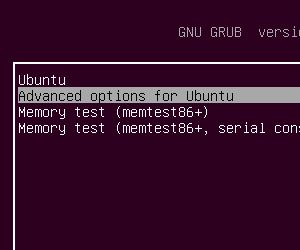

.Exemple d'écran de démarrage GRUB. Une légende peut être une simple phrase ou même la mention du numéro de figure. Cependant, pour certains articles, il peut s'agir de plusieurs paragraphes, d'où la nécessité d'utiliser le style "pragma". Le style utilisé pour une légende.... est "legende".

